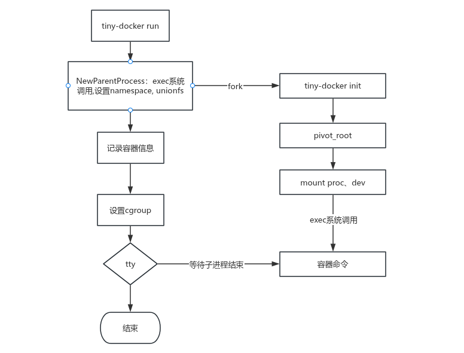

# tiny-docker
一个基于 Linux 底层技术实现的轻量级 Docker 简化版本，参考《自己动手写Docker》（陈显鹭 等）实现，并针对功能、兼容性、稳定性进行了扩展与修复，核心目标为学习容器底层原理（Namespace/Cgroups/UnionFS/虚拟网络）。

## 1. 项目概述
tiny-docker 聚焦容器核心底层技术的落地实现，通过复刻 Docker 核心逻辑，深入理解容器的隔离、资源限制、文件系统、网络等核心能力。本项目以学习为导向，欢迎提交 Issue/PR 指出问题或贡献代码。

核心实现技术：
- **Namespace**：实现进程/网络/挂载等资源的隔离；
- **Cgroups**：限制容器的 CPU/内存/IO 等资源（兼容 cgroup v2）；
- **Union File System**：采用 overlay2 实现容器镜像的分层存储；
- **Linux 虚拟网络**：基于 veth/bridge/iptables 实现容器网络隔离与通信。
## 2.核心改进（与原参考版本对比）
### 2.1 新功能
1. 存储驱动替换为 overlay2；
2. 全面兼容 cgroup v2（适配现代 Linux 内核）；
3. 新增工作空间清理脚本（`cleanup.sh`），简化本地测试流程；
4. 新增强制删除容器功能（类似 `docker rm -f`）；
5. 完善网络驱动删除逻辑，避免虚拟网卡/网桥残留。
### 2.2 bug修复
1. 修复 mount 传播导致的宿主机 `/proc` 文件系统污染问题；
2. 修复容器继承宿主机环境变量的安全问题；
3. 修复后台运行容器退出后，工作空间未自动清理的问题。
### 2.3 依赖相关
1. 升级 Go 版本，启用 GO111MODULE 模块化管理；
2. 更新第三方依赖（如 cli 框架、slog 日志库），提升稳定性。
## 3.待解决问题（TODO）
1. Cgroups 资源限制后未正确清理（优先修复）；
2. 网络分配的位图算法可以优化
3. 暂未实现跨主机网络通信（计划基于 VXLAN 补充）。
## 4.项目结构

## 5.核心概念
### 5.1 namespace
|    命名空间类型   | 对应的 clone() 标志位 |            隔离的核心资源           |
| :---------: | :-------------: | :--------------------------: |
|   **UTS**   |  CLONE\_NEWUTS  | 主机名（hostname）、域名（domainname） |
|   **IPC**   |  CLONE\_NEWIPC  |    进程间通信资源（消息队列、共享内存、信号量等）   |
|   **PID**   |  CLONE\_NEWPID  |          进程 ID 编号空间          |
| **Network** |  CLONE\_NEWNET  |   网络资源（网卡、IP 地址、端口、路由、防火墙等）  |
|  **Mount**  |   CLONE\_NEWNS  |         挂载点（文件系统目录树）         |
|   **User**  |  CLONE\_NEWUSER |     用户 ID（UID）、组 ID（GID）     |

Namespace 核心系统调用：
- `clone()`：创建新进程并加入指定 Namespace；
- `unshare()`：将当前进程移出某个 Namespace；
- `setns()`：将当前进程加入已存在的 Namespace。

### 5.2 cgroup
Cgroups（Control Groups）是 Linux 内核提供的资源限制机制，可对进程组的 CPU、内存、IO、PID 等资源进行精细化控制。

本项目适配特性：
- **cgroup v1**：兼容传统多层级控制器（cpu/memory/blkio 等）；
- **cgroup v2**：适配单层级统一架构（现代内核默认，如 Linux 5.0+），简化资源配置逻辑；
- 注：macOS 虚拟化环境因 CPU 架构限制，仅支持 cgroup v2。

### 5.3 union file system
联合文件系统可将多个只读/可写的文件层叠加为一个统一的文件视图，是容器镜像分层存储的核心。

本项目实现：
- 核心驱动：overlay2（Docker 主流存储驱动，相比 aufs 更轻量、兼容性更好）；
- 核心技术：
  - `chroot`：切换进程的根文件系统，限制文件访问范围；
  - `pivot_root`：替代 chroot，更安全地切换根文件系统（避免原根目录被占用）。

### 5.4 linux虚拟网络
容器网络隔离与通信的核心实现依赖：
- `veth`：创建成对的虚拟网卡，实现容器与宿主机的网络连通；
- `bridge`：创建虚拟网桥（如 `docker0`），实现容器间网络互通；
- `iproute2`：配置容器网络参数（IP/路由）；
- `iptables`：实现端口映射（NAT），让容器可被外部访问。
## 6. 快速开始
### 6.1 环境要求
- Linux 内核 5.0+（推荐），开启 cgroup v2、overlay2 支持；
- Go 1.18+（启用 GO111MODULE）；
- 依赖工具：iproute2、iptables、mount、rsync。

### 6.2 编译与运行
```bash
# 克隆仓库
git clone https://github.com/你的用户名/tiny-docker.git
cd tiny-docker

# 编译
go mod tidy
go build -o tiny-docker ./cmd

# 运行示例（创建并进入容器）
sudo ./tiny-docker run -it busybox sh